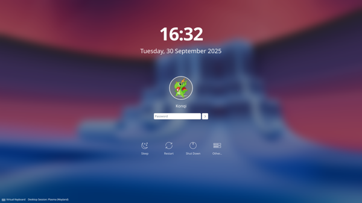
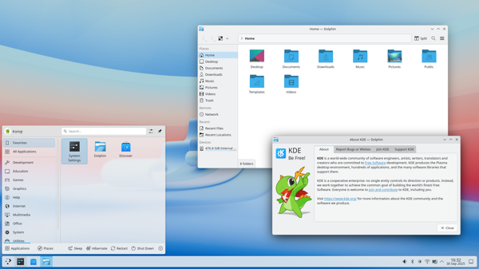

# WinterLock

WinterLock is a KDE Plasma 6 lock-screen theme with the standard Plasma/Breeze
authentication interface, an ice-blue Orbitron clock, and an optional live
Winter video background.





## Compatibility warning

WinterLock installs a complete local override of
`org.kde.plasma.desktop` in `~/.local/share/plasma/shells/`. This is necessary
because current Plasma 6 KScreenLocker loads its lock screen from the active
shell package rather than from a Look-and-Feel package.

The override may need to be rebuilt after major Plasma upgrades. Use the
included uninstaller before troubleshooting a Plasma shell issue.

## Installation

Requirements:

- KDE Plasma 6 and KScreenLocker
- `kpackagetool6` and `plasma-apply-lookandfeel`
- Qt 6 Multimedia (`qt6-multimedia` on Arch/CachyOS)
- An H.264/MP4 background video

The original SDDM Winter `bg.mp4` is **not included**. Its license cannot be
verified from the installed theme, so it is not redistributed here.

Supply your own video explicitly:

```bash
./install.sh --video /path/to/winter-background.mp4
```

Alternatively, the installer will use either of these files when present:

- `~/.local/share/winterlock/background.mp4`
- `/usr/share/sddm/themes/winter/bg.mp4`

The selected video is copied into the local shell override. Installation never
modifies `/usr/share`.

## Uninstallation

```bash
./uninstall.sh
```

The installer backs up an existing local `org.kde.plasma.desktop` override
before replacing it. The uninstaller removes only a WinterLock-managed
override and restores the newest backup when one is available.

## Testing

```bash
/usr/lib/kscreenlocker_greet --testing --shell org.kde.plasma.desktop
loginctl lock-session
```

## Repository layout

- `look-and-feel/io.github.fizzy444.winterlock` — Global Theme package.
- `shells/org.kde.plasma.desktop` — local fork containing the active
  WinterLock lock-screen implementation.

## Releases

Once you have tested installation and uninstallation on a clean Plasma 6
session, create a GitHub release (recommended first tag: `v1.0.0`).
